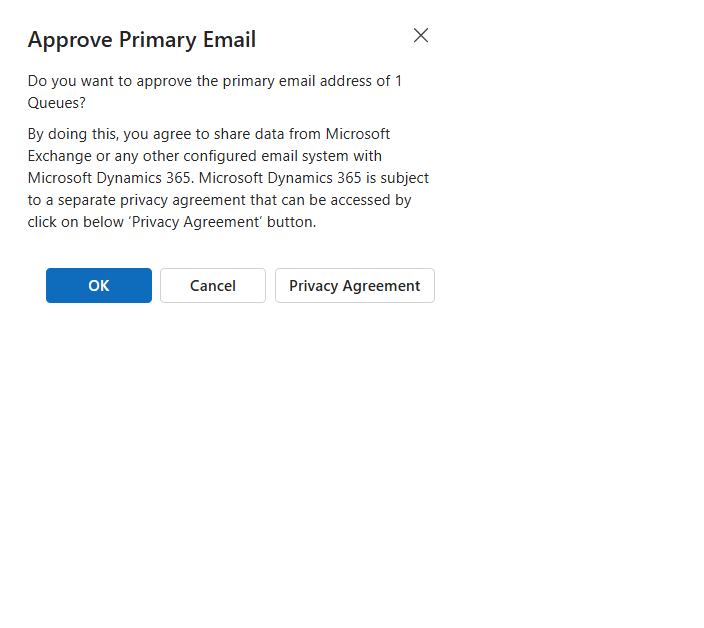
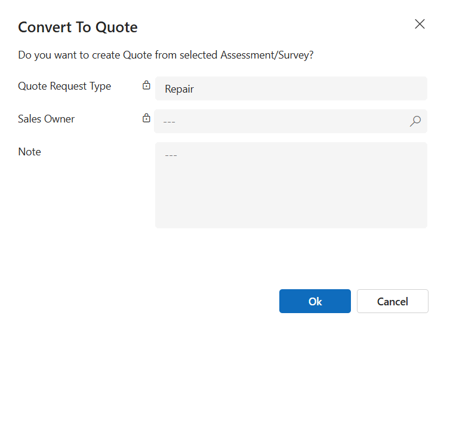

Welcome to ```Dataverse Dialog Builder```, a managed solution helps you build Microsoft Dataverse OOB dialogs, such as the ```Assign dialog```, ```Close Opportunity dialog```, ...

If you are a ```Microsoft Dataverse developer```, especially when working on model-driven app, you encounter a lot of dialogs like the ones shown in the images below.\


# Questions:
**1.** Can I build a custom dialog like that?
> Yes.

**2.** But I don't see any documents that Microsoft refers to regarding this?
> Yes, there are no documents.

**3.** I understand that if there are no documents from Microsoft, and you can achieve this in the model-driven app, it means you are writing **```unsupported code```**?
> Yes, you corrected.

**4.** **```Unsupported code```**?
> Yes, until now. But I believe that in the future, this will be ```supported```. Let's see.

**5.** It very risk for our projects?
> I don't think so. If you believe it is, you can close the browser and not read anything.

**6.** Ok, tell my why **```unsupported code```**?
> Because we used ```2``` functions that not list in the Microsoft documents.
```js
Xrm.Navigation.openDialog(...)
```
```js
formContext.ui.moveTo(...)
```
**7.** Not list in the Microsoft document?
> Yes, [here](https://learn.microsoft.com/en-us/power-apps/developer/model-driven-apps/clientapi/reference/xrm-navigation), and [here](https://learn.microsoft.com/en-us/power-apps/developer/model-driven-apps/clientapi/reference/formcontext-ui). And you ```don't``` see ```2``` functions I mention above. Mean **```unsupported code```**.

**8.** What are the benefits of using ```Dataverse Dialog Builder```?
> 1. If you ignore the ```2``` functions I mentioned above, all your knowledge of ```JavaScript``` and ```WebApi``` remains the same as what you're already familiar with. For example, you have an ```OnLoad``` event on form, then you can access ```formContext```. Then, you can use ```getAttribute``` to get or set values, manipulate controls with ```getControl``` to hide or show them, ```addPreSearch``` logic to filter lookup, or ```addOnChange``` logic, or trigger ```fireOnChange```, ... In essence, ```dialog``` are similar to the ```main``` form you've known before.
> 2. Once you've built a ```dialog``` using ```Dataverse Dialog Builder```, you can use it across various platforms, including ```Desktop Web```, ```Mobile Web```, ```Mobile App```, ```Dynamics 365 App for Outlook```, ```Unified Service Desk```, ```Omnichannel```, ```...```

**9.** Show me some dialogs you've built?
>Absolutely! I, [PhuocLe](https://github.com/phuocle), can confirm that I have built several dialogs and successfully run them in production for many years.\


**10.** Crm Dialog?
>```Crm Dialog``` was the initial version of the ```Dataverse Dialog Builder```. Subsequently, it was renamed to ```Dataverse Dialog Builder```.

**11.** Why I show you the initial version?
>If you go to the [Crm Dialog](https://github.com/phuocle/crmdialog) repository, you will see my last committed code in this repository from many years ago. In this repository, I shared a blog post about [crmdialog](https://www.phuocle.net/post/2020-06-20-crmdialog) that I wrote on June 20, 2020. The initial version involved many manual tasks and required careful reading of the ```Crm Dialog``` documents. That's why I reworked it, and the ```Dataverse Dialog Builder``` was born.

**12.** How you do that?
>1. If you are a Microsoft Dataverse developer, you are likely familiar with some form types: ```Main```, ```Quick Create```, ```Quick View```, ```Card```, ```...```. But did you know that there is another form type called ```Dialog``` (```OptionSet value = 8```)? You can build a ```FetchXml``` query with the filter value ```8``` for the attribute ```type``` in the ```systemform``` entity in your current environment to retrieve all your dialogs.
>2. Navigate to the [DataverseDialogBuilder.Others\dialogs](https://github.com/phuocle/Dataverse-Dialog-Builder/tree/main/DataverseDialogBuilder.Others/dialogs) folder, where you'll find ```323``` dialog files that I obtained from Microsoft ```first-party apps```. I believe these files will continue to grow in the future as more ```first-party apps``` are developed by Microsoft.
> 3. Consider a scenario where you need to examine a single file. Your task involves manually constructing the ```FormXml``` and subsequently saving it to the ```systemform``` entity. This manual process can be challenging. However, the ```Dataverse Dialog Builder``` solution simplifies this by assisting you in building ```FormXml``` and seamlessly saving it back to the ```systemform``` entity.

**13.** Try, Errors, Results -> Try, Errors, Results -> ...
>Yes, I meticulously examined each file, analyzed them one by one, manually constructed ```FormXml```, and experimented with updating the ```systemform``` entity to observe errors and results. This process was labor-intensive, spanning many days, months, and even years. Subsequently, I extracted conventions from the ```FormXml```, which I later leveraged to create ```Dataverse Dialog Builder```.

# Links
The following links are from a Google search. The first post dates back to 2018, which is six years ago. Surprisingly, the ```dialog``` is still functional, and nothing has changed with the ```2``` functions I mentioned earlier. This suggests that the remains **```unsupported code```** but still works.

* July 22, 2018 [Custom Dialog Boxes - Part 1](https://bguidinger.com/blog/custom-dialog-boxes-part-1)
* July 29, 2018 [Custom Dialog Boxes - Part 2](https://bguidinger.com/blog/custom-dialog-boxes-part-2)
* June 10, 2019 [Dynamics 365 - Custom Dialogs in UCI - Part 3](https://blog.thenetw.org/2019/06/10/dynamics-365-custom-dialogs-in-uci-part-3)
* May 22, 2020 [Dynamics 365 – Custom Dialogs in UCI – Part 4](https://blog.danijel.se/posts/dynamics-365-custom-dialogs-in-uci-part-4)

# Wiki

* [Install Dataverse Dialog Builder](https://github.com/phuocle/Dataverse-Dialog-Builder/wiki/Install-Dataverse-Dialog-Builder)
* [Use Dataverse Dialog Builder](https://github.com/phuocle/Dataverse-Dialog-Builder/wiki/Use-Dataverse-Dialog-Builder)
* [Controls](https://github.com/phuocle/Dataverse-Dialog-Builder/wiki/Controls)

# Examples

* [Find User Id](https://github.com/phuocle/Dataverse-Dialog-Builder/wiki/Find-User-Id)
* [Another Assign](https://github.com/phuocle/Dataverse-Dialog-Builder/wiki/Another-Assign)

# Syntax
* [Xrm.Navigation.openDialog(...)](https://github.com/phuocle/Dataverse-Dialog-Builder/wiki/openDialog)
* [formContext.ui.moveTo(...)](https://github.com/phuocle/Dataverse-Dialog-Builder/wiki/moveTo)

# Contribute
1. Fork this repository.
2. [Create a developer environment](https://learn.microsoft.com/en-us/power-platform/developer/create-developer-environment).
3. [Install Dataverse Dialog Builder](https://github.com/phuocle/Dataverse-Dialog-Builder/wiki/Install-Dataverse-Dialog-Builder).
4. Open solution ```DataverseDialogBuilder.sln``` in ```Visual Studio 2022``` and ensure that you build it without any errors.
5. Run ```npm install``` from the ```DataverseDialogBuilder.GrapesJS``` folder.
6. After that, run ```npm run start``` to develop the ```Dataverse Dialog Builder``` in locally.
7. When you need deploy to Dataverse, run the file ```BUILD_AND_DEPLOY_ALL.bat``` in the ```DataverseDialogBuilder.WebResource``` folder.
8. Push and create a pull request to your repository.
9. Then pull request your code to the ```Dataverse Dialog Builder``` repository.

>Note: solution ```DataverseDialogBuilder.sln``` uses [DynamicsCrm.DevKit](https://github.com/phuocle/Dynamics-Crm-DevKit), which I also built.

# Conclusion
**```Unsupported code```**, However, I believe that in the future, this will become ```supported code```. Why? Well, in ```Question 12, Answer 2```, I showed you ```323``` dialog files (and perhaps there will be even more in the future) that I obtained from Microsoft ```first-party apps```. If Microsoft modifies the ```2``` functions I mentioned earlier, we can debug and adapt them, just like they do with their ```first-party apps```. I don’t think Microsoft would deprecate dialogs and then they need to rebuild them across all their ```first-party apps```.